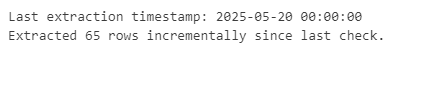

# ETL Extract Lab

**Student Name:** Selmah Tzindori  
**Student ID:** 669602  
**Course:** DSA 2040A - Lab 3 US 2025 (Take-Home Lab: Practicing Extraction in ETL)

---

## Project Overview

This lab demonstrates the core logic of an **ETL (Extract, Transform, Load)** process with a focus on **extraction strategies** using Python. It simulates how an analyst or data engineer might process real-world sports performance data using both full and incremental extraction methods. The core of this project is implemented in Jupyter Notebook and uses custom-generated synthetic sports data for a realistic feel.

---

## What the Notebook Does

The Jupyter Notebook contains:

- **Synthetic data generation** of 200 sports records with fields such as `player_id`,`player_name`,`team`,`match_date`,`points_scored`,`assists`,`rebounds`,`last_updated`
- **Full extraction** logic that retrieves all data from the CSV file regardless of when it was last updated.
- **Incremental extraction** logic that only fetches records **after** a stored timestamp (`last_extraction.txt`).
- Updating the `last_extraction.txt` file after each successful incremental extract to ensure only new data is processed next time.
-Proper date-time handling, even when the dataset has dates **without timestamps**.

---

## ⚙️ Tools & Technologies

| Tool           | Purpose                                |
|----------------|----------------------------------------|
| Python         | Core programming language              |
| Jupyter Notebook | Interactive development environment   |
| pandas         | Data manipulation and filtering        |
| datetime       | Timestamp comparison & formatting      |
| faker          | To generate fake names and realistic dates    |

---

## 🧬 Data Used

The dataset consists of **synthetically generated basketball performance records**, containing 200 rows and the following fields:

| Column Name      | Description                                   |
|------------------|-----------------------------------------------|
| `player_id`      | Unique identifier for each player             |
| `player_name`    | Name of the player                            |
| `team`           | The player’s team name                        |
| `match_date`     | Date when the match occurred (`YYYY-MM-DD`)   |
| `points_scored`  | Number of points scored in the match          |
| `assists`        | Number of assists made                        |
| `rebounds`       | Number of rebounds made                       |
| `last_updated`   | Date the record was last modified (`YYYY-MM-DD`) |

Note: Since the data only contains dates (no timestamps), the script appends `"00:00:00"` to standardize them for comparison during incremental extraction.

---


## Extraction Methods

### Full Extraction

- Extracts all data from the CSV file.
- Used for first-time extraction or when no historical extraction file exists.


### Incremental Extraction

- Compares each record’s `last_updated` date to the timestamp stored in `last_extraction.txt`.
- Only extracts **new or updated records**.
- Updates the timestamp in `last_extraction.txt` to reflect the latest data processed.

---

# 🧪 ETL Extract Lab

**Student Name:** Selmah Tzindori  
**Student ID:** 669602  
**Course:** DSA 2040A - Lab 3 US 2025 (Take-Home Lab: Practicing Extraction in ETL)

---

## 📚 Table of Contents

- [📘 Project Overview](#-project-overview)
- [🔍 What the Notebook Does](#-what-the-notebook-does)
- [⚙️ Tools & Technologies](#️-tools--technologies)
- [🧬 Data Description](#-data-description)
- [🔄 Extraction Methods](#-extraction-methods)
  - [✅ Full Extraction](#✅-full-extraction)
  - [🔁 Incremental Extraction](#🔁-incremental-extraction)
- [🚀 Getting Started](#-getting-started)
- [🤝 Contributing](#-contributing)
- [📄 License](#-license)

---

## 📘 Project Overview

This lab simulates the **extraction** stage of an ETL (Extract, Transform, Load) pipeline using Python and Jupyter Notebook. It demonstrates how a data engineer might extract new or complete data from a structured dataset, using both **full** and **incremental** strategies, powered by synthetic sports performance data.

---

## 🔍 What the Notebook Does

- Generates **200 synthetic basketball records**.
- Performs:
  - ✅ **Full extraction**: All rows pulled from source CSV.
  - 🔁 **Incremental extraction**: Only new/updated rows are pulled.
- Updates a **timestamp file** (`last_extraction.txt`) after each incremental extraction.
- Handles and formats date strings for timestamp comparison.

---

## ⚙️ Tools & Technologies

| Tool            | Purpose                                      |
|-----------------|----------------------------------------------|
| Python          | Main programming language                    |
| Jupyter Notebook| Interactive development and testing          |
| pandas          | Data manipulation and filtering              |
| datetime        | Handling and comparing timestamps            |
| faker           | Generates realistic fake data for simulation |

---

## 🧬 Data Description

The dataset is **synthetically generated** using `faker` and contains 200 rows of basketball performance stats.

| Column Name     | Description                                      |
|-----------------|--------------------------------------------------|
| `player_id`     | Unique player identifier                         |
| `player_name`   | Name of the player                               |
| `team`          | Player’s team name                               |
| `match_date`    | Date of the match (YYYY-MM-DD)                   |
| `points_scored` | Number of points scored                          |
| `assists`       | Number of assists made                           |
| `rebounds`      | Number of rebounds made                          |
| `last_updated`  | Last modified date of the record (YYYY-MM-DD)    |

> 📌 All dates are standardized to include `"00:00:00"` for accurate datetime comparison.

---

## 🔄 Extraction Methods

### ✅ Full Extraction

- Retrieves **all data** from the source CSV.
- Useful during initial ETL runs or complete reloads.

### 🔁 Incremental Extraction

- Extracts only **new or modified records**.
- Compares `last_updated` to the date stored in `last_extraction.txt`.
- Updates the timestamp file after a successful extraction.

---

## 🚀 Getting Started

1. **Clone the Repository**  
   ```bash
   git clone https://github.com/SelmahT/ETL_Extract_SelmahTzindori.git
   cd ETL_Extract_SelmahTzindori
   
2. **Install Dependencies**
  - Use pip to install required libraries: 
   ```bash
   pip install pandas faker jupyter

3. **Run the Notebook**
 - Launch Jupyter and run the notebook:
  ```bash
  jupyter notebook ETL_Extract_Lab.ipynb

---

## 🤝 Contributing
If you'd like to improve this notebook, feel free to:

Fork the repository

Create a new branch (git checkout -b improve-extraction)

Commit your changes (git commit -m 'Enhance incremental logic')

Push to your fork (git push origin improve-extraction)

Open a Pull Request
---
## License
This project is licensed under the MIT License
