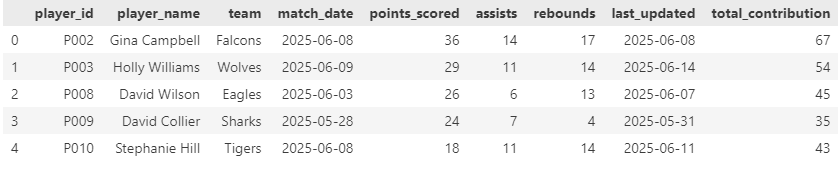
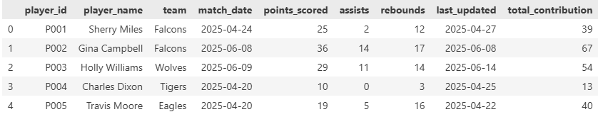
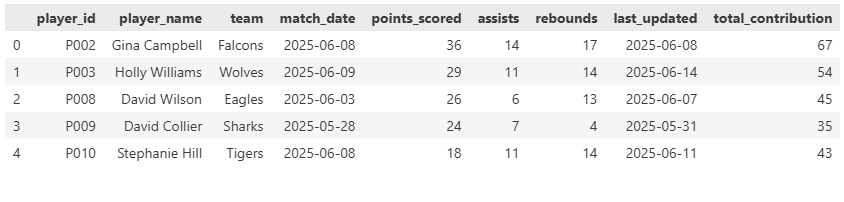

# ETL LABS

**Student Name:** Selmah Tzindori  
**Student ID:** 669602  
**Course:** DSA 2040A (Lab 3_Extraction process in ETL)

---
## Project Overview


This lab demonstrates the core logic of an **ETL (Extract, Transform, Load)** process with a focus on **extraction strategies** using Python. It simulates how an analyst or data engineer might process real-world sports performance data using both full and incremental extraction methods. The core of this project is implemented in Jupyter Notebook and uses custom-generated synthetic sports data for a realistic feel.

---

## What the Notebook Does

The Jupyter Notebook contains:

- **Synthetic data generation** of 200 sports records with fields such as `player_id`,`player_name`,`team`,`match_date`,`points_scored`,`assists`,`rebounds`,`last_updated`
- **Full extraction** logic that retrieves all data from the CSV file regardless of when it was last updated.
- **Incremental extraction** logic that only fetches records **after** a stored timestamp (`last_extraction.txt`).
- Updating the `last_extraction.txt` file after each successful incremental extract to ensure only new data is processed next time.
-Proper date-time handling, even when the dataset has dates **without timestamps**.

---

##  Tools & Technologies

| Tool           | Purpose                                |
|----------------|----------------------------------------|
| Python         | Core programming language              |
| Jupyter Notebook | Interactive development environment   |
| pandas         | Data manipulation and filtering        |
| datetime       | Timestamp comparison & formatting      |
| faker          | To generate fake names and realistic dates    |

---

##  Data Used

The dataset consists of **synthetically generated basketball performance records**, containing 200 rows and the following fields:

| Column Name      | Description                                   |
|------------------|-----------------------------------------------|
| `player_id`      | Unique identifier for each player             |
| `player_name`    | Name of the player                            |
| `team`           | The player’s team name                        |
| `match_date`     | Date when the match occurred (`YYYY-MM-DD`)   |
| `points_scored`  | Number of points scored in the match          |
| `assists`        | Number of assists made                        |
| `rebounds`       | Number of rebounds made                       |
| `last_updated`   | Date the record was last modified (`YYYY-MM-DD`) |

Note: Since the data only contains dates (no timestamps), the script appends `"00:00:00"` to standardize them for comparison during incremental extraction.

---


## Extraction Methods

### Full Extraction

- Extracts all data from the CSV file.
- Used for first-time extraction or when no historical extraction file exists.


### Incremental Extraction

- Compares each record’s `last_updated` date to the timestamp stored in `last_extraction.txt`.
- Only extracts **new or updated records**.
- Updates the timestamp in `last_extraction.txt` to reflect the latest data processed.
- Output can change because it is simulated data,that is randomly generated

---
#  DSA 2040A - Lab 4: Transform in ETL

##  Objective  
To reinforce understanding of data transformation by extending the existing ETL pipeline with transformation logic that prepares extracted data for analysis.

---

## ETL Pipeline Overview

The ETL pipeline has been extended to include **data transformation**, applied to both full and incremental datasets.

### Transformation Steps Applied

1. **Cleaning**
   - Removed rows with missing values (`NaN`)
   - Dropped duplicate rows

2. **Enrichment**
   - Added a new column:  
     `total_contribution = points_scored + assists + rebounds`

3. **Structural Changes**
   - Converted `match_date` and `last_updated` to standard datetime format

4. **Preview of Transformed Full Dataset**


5. **Preview of transformed incremental data set**


---

##  Output Files

| File Name                    | Description                                      |
|-----------------------------|--------------------------------------------------|
| `transformed_full.csv`      | Fully transformed full dataset                   |
| `transformed_incremental.csv` | Fully transformed incremental dataset           |

---

##  Notebooks

- **`etl_extract.ipynb`**
  - Section 1: Setup & Imports  
  - Section 2: Full Extraction  
  - Section 3: Incremental Extraction  

- **`etl_transform.ipynb`**
  - Section 4: Transform Full Data  
  - Section 5: Transform Incremental Data  

Both notebooks are cleanly separated for clarity and modularity.


---

## Submission Notes

- All required files are included in this GitHub repository
- The project satisfies the requirement of applying **at least 3 transformations**
- This submission builds upon the previous Lab 3 work

---

# DSA 2040A - Lab 5: Load in ETL
## Objective
- To finalize the ETL process by loading the transformed datasets into structured storage using SQLite databases.

---
## ETL Pipeline Overview (Load Phase)
- The ETL pipeline has now been extended to include the Load stage, where both the transformed full and incremental datasets are stored in a structured format using SQLite
---

## Loading Method Used
- SQLite was selected for its simplicity and built-in support in Python.

- Python’s sqlite3 library was used to write Pandas DataFrames directly into database files.

- Each dataset was stored in its own .db file inside a loaded_data/ directory.

---
## Loading Steps Applied
### 1. Full Transformed Data
- Input file: transformed_full.csv

- Target database: loaded_data/full_data.db

- SQLite table name: full_data


#### Code used:
```bash
df_full = pd.read_csv("transformed_full.csv")
conn = sqlite3.connect("loaded_data/full_data.db")
df_full.to_sql("full_data", conn, if_exists="replace", index=False)
conn.close()

```
---
### 2. Incremental Transformed Data
- Input file: transformed_incremental.csv

- Target database: loaded_data/incremental_data.db

- SQLite table name: incremental_data

#### Code used:
```bash
df_incremental = pd.read_csv("transformed_incremental.csv")
conn = sqlite3.connect("loaded_data/incremental_data.db")
df_incremental.to_sql("incremental_data", conn, if_exists="replace", index=False)
conn.close()
```
---

### 3. Verification
- A SQL query was run to confirm that the tables were successfully loaded
```bash
conn = sqlite3.connect("loaded_data/full_data.db")
preview = pd.read_sql("SELECT * FROM full_data LIMIT 5;", conn)
conn.close()
print(preview.head())

```
### Outputs to show verifiaction of loaded tables
#### Full load output

#### Incremental load output

---

### Output files
| File Name             | Description                                   |
| --------------------- | --------------------------------------------- |
| `full_data.db`        | SQLite DB for full transformed dataset        |
| `incremental_data.db` | SQLite DB for incremental transformed dataset |

---

##  Getting Started

1. **Clone the Repository**  
```bash
   git clone https://github.com/SelmahT/ETL_Extract_SelmahTzindori.git
   cd ETL_Extract_SelmahTzindori
```   
2. **Install Dependencies**
  - Use pip to install required libraries: 
```bash
pip install pandas faker jupyter
```

3. **Run the Notebook**
 - Launch Jupyter and run the notebook:
```bash
jupyter notebook ETL_Extract_Lab.ipynb
```
---

##  Contributing
If you'd like to improve this notebook, feel free to:

Fork the repository

Create a new branch (git checkout -b improve-extraction)

Commit your changes (git commit -m 'Enhance incremental logic')

Push to your fork (git push origin improve-extraction)

Open a pull request


---
## License
This project is licensed under the MIT License
